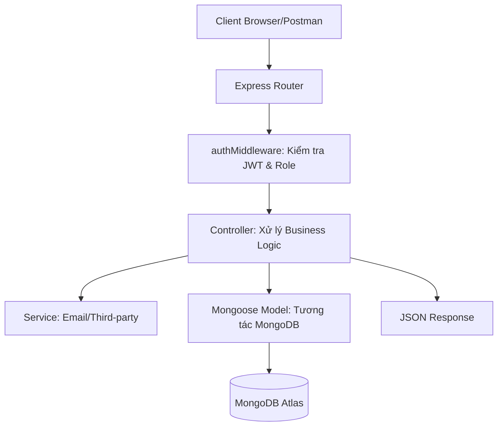

# 🛡️ Tài liệu Kỹ thuật Toàn diện Hệ thống BackEnd (Master Edition)

Hệ thống BackEnd được xây dựng trên nền tảng **Node.js** và **Express**, sử dụng cơ sở dữ liệu **MongoDB** (thông qua Mongoose). Hệ thống được thiết kế theo mô hình **MVC (Model-View-Controller)** mở rộng, đảm bảo tính chuẩn hóa dữ liệu và bảo mật đa lớp.

---

## 📂 1. Danh mục Tổng hợp (Plaintext & Tree View)

### 📊 Tóm tắt Danh mục Hệ thống (Plaintext)
**Controllers (16):** adminController, authController, classController, classSectionController, collegeController, dashboardController, facultyController, gradeController, majorController, setupController, studentController, subjectController, systemController, teacherController, termController, weeklyOverrideController.

**Models (12):** Class, ClassSection, College, Faculty, Grade, Major, Student, Subject, SystemConfig, Teacher, Term, User.

**Routes (15):** adminRoutes, authRoutes, classRoutes, classSectionRoutes, collegeRoutes, dashboardRoutes, facultyRoutes, gradeRoutes, majorRoutes, setupRoutes, studentRoutes, subjectRoutes, systemRoutes, teacherRoutes, termRoutes.

**Middleware:** authMiddleware.js.

**Services:** emailService.js.

### 🌳 Cấu trúc Thư mục Hệ thống (Visual Tree View)
```text
backEnd/
├── 📁 src/
│   ├── 📁 config/           # db.js (Cấu hình kết nối MongoDB Atlas)
│   ├── 📁 Controllers/      # 16 Controller xử lý Logic nghiệp vụ
│   ├── 📁 middleware/       # authMiddleware.js (JWT & Role RBAC)
│   ├── 📁 models/           # 12 Mongoose Schemas (Định nghĩa dữ liệu)
│   ├── 📁 routes/           # 15 Nhóm Router (Lộ diện các API endpoint)
│   ├── 📁 services/         # emailService.js (Nodemailer & OTP)
│   └── server.js            # Entry Point, khởi tạo Express và Middlewares
├── 📁 scripts/              # Các kịch bản nạp dữ liệu (Seeding)
├── .env                     # Biến môi trường (MONGO_URI, JWT_SECRET...)
└── package.json             # Danh sách thư viện: express, mongoose, jsonwebtoken...
```

---

## 🏗️ 2. Kiến trúc & Luồng Xử lý Dữ liệu (System Architecture)

Hệ thống tuân thủ nghiêm ngặt quy trình xử lý yêu cầu qua các lớp bảo mật và logic.



---

## ⚙️ 3. Phân tích Chi tiết 16 Tầng Controllers (Logic Nghiệp vụ)

Tầng Controller là "bộ não" của hệ thống, điều phối dữ liệu từ Request sang Model và trả về Response.

| File Controller | Chức năng chi tiết & Logic cốt lõi |
| :--- | :--- |
| `authController.js` | Quản lý định danh: `login` (Bcrypt compare), `register`, `forgotPassword` (Gen OTP), `resetPassword`. Quản lý luồng **Google OAuth 2.0**. |
| `studentController.js` | Quản lý SV: `getStudents` (Filter by major/class), `createStudent`, `updateStudent`. Hỗ trợ **Bulk Import** qua `import_teachers.js`. |
| `teacherController.js` | Quản lý GV: Lưu hồ sơ chuyên môn, gán khoa quản lý; Tích hợp logic tìm kiếm GV theo phân cấp ngành. |
| `gradeController.js` | **Cực kỳ quan trọng**: `batchSaveGrades` (Lưu điểm hàng loạt), `lockGrades` (Khóa điểm kỳ). Tự động tính điểm trung bình (Pre-save hook). |
| `weeklyOverrideController.js`| **Logic phức tạp**: Cho phép giảng viên `createOverride` (Hủy/Đổi phòng/Online) cho từng tuần cụ thể mà không làm hỏng lịch gốc. |
| `classSectionController.js` | Quản lý Lớp học phần: Mở lớp theo kỳ, phân `Phase 1/2`, chọn hình thức `Blended/In-person` và gán Giảng viên. |
| `adminController.js` | Quyền tối cao: Quản lý danh sách tài khoản toàn hệ thống, gán Role cho user mới. |
| `dashboardController.js` | Aggragation: Tổng hợp dữ liệu từ nhiều Collection (Student, Grade, Class) để trả về các biểu đồ xu hướng GPA. |
| `setupController.js` | `getSetupStatus` (Check DB empty) và `initializeSystem` (Tạo SuperAdmin và cấu hình UEH ban đầu). |
| `termController.js` | Quản lý Kỳ học: Định nghĩa startDate/endDate cho từng kỳ (HK1, HK2, Hè). |
| `subjectController.js` | Quản lý Môn học: Mã môn (Subject Code), Số tín chỉ (Credits), và Khoa trực thuộc môn học. |
| `systemController.js` | Cấu hình toàn cục: Quản lý các biến môi trường và thiết lập hiển thị (Logo, Tên trường) trên toàn UI. |
| `collegeController.js` | Cấp cao nhất: Quản lý danh sách trường thành viên (VD: Trường Kinh Doanh, Trường Công Nghệ). |
| `facultyController.js` | Quản lý Khoa: Trực thuộc các College, là lớp trung gian quản lý các Majors. |
| `majorController.js` | Quản lý Ngành: Xác định chương trình đào tạo cho các lớp sinh viên (Administrative Classes). |
| `classController.js` | Lớp Hành chính: Quản lý danh sách lớp sinh hoạt (VD: IS001, CS002) và ngành học tương ứng. |

---

## 💾 4. Phân tích Chi tiết 12 Models (Mongoose Schemas)

Định nghĩa cấu trúc dữ liệu và các mối quan hệ (Relationships) trong MongoDB.

- **User.js**: 
  - Fields: `email`, `password` (hashed), `role` (Admin/Teacher/Student/Manager).
  - Logic: Tự động mã hóa mật khẩu trước khi lưu (`pre-save`).
- **Student.js**: 
  - Liên kết với `User` qua `userId` và `Major` qua `majorId`.
  - Chứa `studentCode` (MSSV) và thông tin cá nhân.
- **Grade.js**: 
  - Fields: `midterm`, `final`, `attendance`.
  - Logic: Tự động tính `totalScore` và `gradeLetter` (A, B, C...) dựa trên tham số hệ số điểm.
- **ClassSection.js**: 
  - Chứa mảng `weeklyOverrides`: Mảng lưu trữ các thay đổi lịch học theo từng tuần lẻ.
  - Liên kết `Subject`, `Teacher`, `Term`.
- **SystemConfig.js**: 
  - Singleton Pattern: Chỉ lưu trữ 1 bản ghi duy nhất chứa thông tin cấu hình toàn cục.

---

## 🚦 5. Tầng Routes & API Endpoints (15 Files)

Mỗi file Route định nghĩa các cổng giao tiếp và áp dụng Middleware bảo mật.

| Nhóm Route | Prefix URL | Role Protection |
| :--- | :--- | :--- |
| **Auth** | `/api/auth` | Public / JWT Required |
| **Students** | `/api/students` | Admin, Teacher (Read-only for others) |
| **Grades** | `/api/grades` | Teacher (Enter), Admin (Lock), Student (View) |
| **Class Sections**| `/api/class-sections` | Admin (Open), Teacher/Student (View) |
| **Setup** | `/api/setup` | Public (Only if system not initialized) |
| **Dashboard** | `/api/dashboard` | Admin, Teacher, Student (Dynamic data) |

---

## 🛡️ 6. Middleware & Kết nối Dịch vụ

- **authMiddleware.js**: 
  - **Verify JWT**: Giải mã token từ Header để xác định người dùng.
  - **Authorize Roles**: Hàm `authorize('admin', 'teacher')` chặn các truy cập trái phép vào các đầu cuối nhạy cảm.
- **emailService.js**: 
  - Sử dụng **Nodemailer**.
  - Tích hợp Template cho: Gửi mã OTP khôi phục mật khẩu, Thông báo điểm mới cho sinh viên.
- **db.js (Config)**: 
  - Quản lý kết nối Mongoose với MongoDB Atlas.
  - Thiết lập cơ chế tự động kết nối lại (Retry) khi mất mạng.

---

## 🚦 7. Các Luồng Nghiệp vụ Đặc thù (Workflows)

### 7.1 Luồng Ghi đè Lịch học (Weekly Override)
1. Giảng viên yêu cầu thay đổi (VD: Chuyển sang Online tuần 5).
2. `weeklyOverrideController` tìm `ClassSection` tương ứng.
3. Thêm một Object vào mảng `weeklyOverrides` của Section đó.
4. Khi SV xem lịch, hệ thống ưu tiên hiển thị dữ liệu từ `weeklyOverrides` nếu khớp với tuần hiện tại.

### 7.2 Luồng Khóa điểm (Grade Locking)
1. Khi kỳ học kết thúc, Admin gọi API `/api/terms/:id/lock`.
2. Hệ thống cập nhật trạng thái `isLocked: true` trong `Term`.
3. `gradeController` kiểm tra trạng thái Term trước khi cho phép `batchSaveGrades`. Nếu đã khóa, từ chối cập nhật.

---

*Tài liệu này được soạn thảo chi tiết để phục vụ việc bảo trì và mở rộng hệ thống BackEnd chuyên sâu.*
