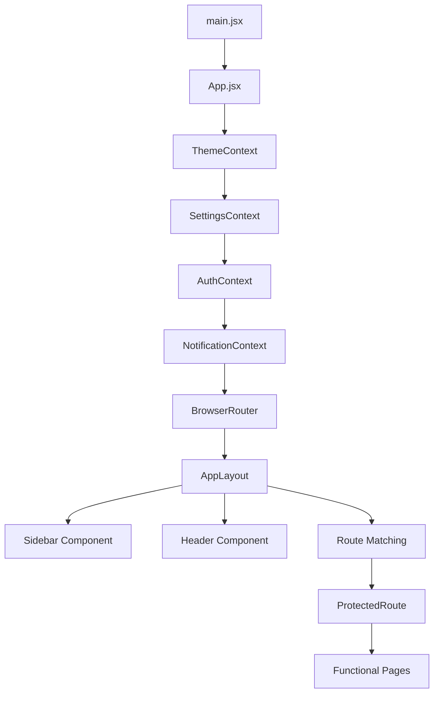

# 🛠️ Tài liệu Kỹ thuật Toàn diện Hệ thống FrontEnd (Master Edition)

### 📂 Tóm tắt Danh mục Hệ thống (Plaintext)
**Pages Modules:** Admin, ClassSections, Dashboard, Grades, Home, Login, Profile, Schedule, Settings, Setup, Students, Subjects, Teachers, Terms.

**API Services:** api.js, authService.js, classSectionService.js, dashboardService.js, exportService.js, gradeService.js, profileService.js, setupService.js, studentService.js, subjectService.js, systemService.js, teacherService.js, termService.js, userService.js.

---

### 📂 Cấu trúc Thư mục Hệ thống (Tree View)
```text
│   ├── 📁 components/
│   │   ├── 📁 Auth/           # ProtectedRoute.jsx
│   │   ├── 📁 Layout/         # AppLayout.jsx, Header.jsx, Sidebar.jsx
│   │   └── 📁 common/         # 15 Module thành phần dùng chung (DataTable, SearchBar,...)
│   ├── 📁 context/            # 7 file Context & Providers (Auth, Theme, Settings, Notification)
│   ├── 📁 hooks/              # Custom Hooks (useAuth, usePermissions, useTranslation,...)
│   ├── 📁 pages/
│   │   ├── 📁 Admin/          # ClassesPage.jsx, UsersPage.jsx
│   │   ├── 📁 ClassSections/  # ClassSectionsPage.jsx
│   │   ├── 📁 Dashboard/      # DashboardPage.jsx
│   │   ├── 📁 Grades/         # ClassGradeSheetPage.jsx, GradeEntryPage.jsx, StudentTranscriptPage.jsx
│   │   ├── 📁 Home/           # HomePage.jsx
│   │   ├── 📁 Login/          # LoginPage.jsx, ForgotPasswordPage.jsx
│   │   ├── 📁 Profile/        # ProfilePage.jsx
│   │   ├── 📁 Schedule/       # StudentSchedulePage.jsx
│   │   ├── 📁 Settings/       # SettingsPage.jsx
│   │   ├── 📁 Setup/          # SetupPage.jsx
│   │   ├── 📁 Students/       # StudentsPage.jsx
│   │   ├── 📁 Subjects/       # SubjectsPage.jsx
│   │   ├── 📁 Teachers/       # TeachersPage.jsx
│   │   └── 📁 Terms/          # TermsPage.jsx
│   ├── 📁 services/           # 14 file API Services (authService, studentService,...)
│   ├── 📁 styles/             # Global.css, Theme tokens
│   ├── App.jsx                # Cấu hình Routing & Context bọc ngoài
│   └── main.jsx               # Entry point khởi tạo App
```

---

Hệ thống FrontEnd của dự án là một ứng dụng Single Page Application (SPA) hiệu năng cao, xây dựng trên nền tảng **React 19**, **Vite**, và **Ant Design v5**. Tài liệu này cung cấp cái nhìn chi tiết nhất về từng file, từng module và luồng vận hành của hệ thống.

---

## 🏗️ 1. Kiến trúc Hệ thống & Luồng Dữ liệu (System Architecture)

### 📊 Sơ đồ Khởi chạy (Bootstrapping Flow)
Hệ thống sử dụng cơ chế bọc nhiều lớp (Higher-Order Providers) để đảm bảo trạng thái toàn cục được duy trì ổn định.



---

## ⚙️ 2. Tầng Services & Kết nối API (14 Dịch vụ Chi tiết)

Tầng Services đóng vai trò lớp trung gian (Data Access Layer), tách biệt logic gọi API khỏi UI.

| Tên File | Chức năng chi tiết & Phương thức quan trọng |
| :--- | :--- |
| `api.js` | **Cơ sở hạ tầng Network**: Khởi tạo Axios Instance; Cấu hình Timeout; Tự động xử lý Authorization Header bằng `Bearer Token`; Xử lý Logic Refresh Token hoặc Redirect khi lỗi 401. |
| `authService.js` | **Vòng đời tài khoản**: `login` (nhận JWT), `register` (đăng ký mới), `googleLogin` (OAuth2), `forgotPassword` (yêu cầu OTP), `resetPassword` (đổi mật khẩu qua token). |
| `systemService.js` | **Cấu trúc dữ liệu trường học**: Quản lý cây phân cấp: `getColleges`, `getFaculties`, `getMajors`, `getClasses`. Quản lý `getConfig` (Lấy mốc thời gian, niên khóa hệ thống). |
| `studentService.js` | **Quản lý Sinh viên**: `getAllStudents` (Hỗ trợ filter phức tạp), `createStudent`, `bulkImportStudents` (Parse Excel data), `getStudentSchedule` (Lịch học kỳ/ngày). |
| `teacherService.js` | **Quản lý Giảng viên**: CRUD thông tin giảng viên; `getTeacherSchedule` (Lịch dạy); **Weekly Overrides** (API đặc thù để đổi phòng/hủy tiết trong 1 tuần nhất định). |
| `userService.js` | **Quản trị User**: `getAllUsers`, `toggleUserStatus` (Lock/Unlock), `updateUserRole` (Gán quyền Admin/GV/SV), `deleteUser`. |
| `termService.js` | **Chu kỳ Đào tạo**: `getAllTerms`, `createTerm`, `updateTerm`, `getActiveTerm` (Lấy học kỳ hiện tại đang mở cửa để nhập điểm/đăng ký học). |
| `subjectService.js` | **Danh mục Môn học**: `getAllSubjects`, `createSubject`, `deleteSubject`. Quản lý thuộc tính: Mã môn, số tín chỉ, khoa phụ trách. |
| `classSectionService.js` | **Lớp học phần (Hệ thống mở lớp)**: CRUD Lớp học phần; Quản lý `phase` (Đợt học 1/2), `teachingMethod` (Trực tiếp/Online), `language` giảng dạy. |
| `gradeService.js` | **Nghiệp vụ Điểm số**: `getGradesByClass` (Lấy danh sách điểm lớp), `saveGrades` (Lưu hàng loạt), `lockGrades` (Niêm phong điểm kỳ), `getStudentTranscript`. |
| `dashboardService.js` | **Thống kê Dashboard**: `getAdminStats`, `getTeacherStats`, `getStudentStats`. Trả về số liệu tổng quan và xu hướng điểm số. |
| `exportService.js` | **Xử lý Files**: Cung cấp logic `exportToExcel` (Sử dụng ExcelJS/XLSX) và `exportToPdf` (Sử dụng jsPDF/html2canvas). |
| `profileService.js` | **Thông tin cá nhân**: `getProfile`, `updateProfile` (Đổi tên, sđt, địa chỉ), `changePassword` (Xác thực mật khẩu cũ), `updateAvatar`. |
| `setupService.js` | **Khởi tạo hệ thống**: `getSetupStatus` (Kiểm tra xem hệ thống đã có Admin hay chưa), `initializeSystem` (Ghi dữ liệu ban đầu vào Database). |

---

## 🧩 3. Hệ thống Components (Giao diện Thành phần)

### 📦 3.1 Layout & Navigation
- **AppLayout.jsx**: Khung xương chính (Shell). Bao quát Sidebar, Header và vùng nội dung Content. Xử lý trạng thái Collapse của Sidebar.
- **Sidebar.jsx**: Danh mục điều hướng. Chứa logic phân quyền Menu: Chỉ hiển thị nội dung khớp với Role. Hỗ trợ Nested Menu (Grades).
- **Header.jsx**: Thanh công cụ trên cùng. Chứa Profile dropdown, Nút bật/tắt toàn màn hình, Tìm kiếm nhanh và Cảnh báo thông báo.

### 📦 3.2 Common Components (15 Thành phần Tái sử dụng)
1. **DataTable**: Bảng dữ liệu Premium. Hỗ trợ Pagination, Sorting tự động, và Empty State chuyên nghiệp.
2. **SearchBar**: Ô tìm kiếm có cơ chế **Debounce** (Giảm số lần gọi API khi gõ nhanh).
3. **AdvancedFilterPanel**: Bảng lọc nâng cao với hiệu ứng chuyển động mượt mà.
4. **BulkImportModal**: Hỗ trợ kéo thả file Excel và hiển thị Preview dữ liệu trước khi Import.
5. **Charts**: Wrapper cho các biểu đồ (Line, Bar, Doughnut) sử dụng thư viện Chart.js hoặc Recharts.
6. **FormModal**: Modal khung chuẩn tích hợp sẵn các nút Lưu/Hủy và Overlay loading.
7. **StatCard**: Thẻ hiển thị số liệu thống kê với Icon và phần trăm tăng/giảm.
8. **ConfirmDialog**: Hộp thoại xác nhận hành động nguy hiểm (Xóa, Khóa).
9. **LoadingSpinner**: Các hiệu ứng loading skeleton hoặc spinner cho từng vùng dữ liệu.
10. **Notifications**: Hệ thống thông báo góc màn hình (Toast) đồng bộ với `NotificationContext`.
11. **ErrorMessage**: Thành phần hiển thị lỗi Validation của Form (Yup/React-Hook-Form).
12. **SuccessMessage**: Thông báo thành công với hiệu ứng confetti hoặc checkmark.
13. **ImageUpload**: Trình tải ảnh đại diện với tính năng Crop hoặc Preview trực tiếp.
14. **Authorization**: Nút bọc (`ProtectedButton`) tự động ẩn/vô hiệu hóa nếu User không đủ quyền.
15. **Animation**: Các thành phần bọc (Wrapper) sử dụng **Framer Motion** để tạo hiệu ứng Fade-in/Slide-up.

---

## 🧠 4. Quản lý Trạng thái Toàn cục (Context API)

Chúng ta có 7 file chính trong thư mục `context`:

- **AuthContext.jsx / AuthProvider.jsx**: 
    - Lưu trữ `user` object, `token`, và `isAuthenticated`.
    - Cung cấp hàm `login`, `logout`, và tự động gọi API `/me` khi reload trang.
- **SettingsContext.jsx / SettingsProvider.jsx**:
    - Quản lý cấu hình giao diện: `language`, `timezone`, `compactMode`.
    - Lưu cấu hình vào `localStorage` để duy trì sau khi đóng trình duyệt.
- **ThemeContext.jsx**:
    - Quản lý trạng thái `darkMode` (Sáng/Tối). 
    - Kết nối với Ant Design `ConfigProvider` để đổi màu chủ đạo (Primary color).
- **NotificationContext.jsx**:
    - Quản lý danh sách thông báo hệ thống của người dùng.
    - Xử lý logic đánh dấu đã đọc (`markAsRead`).

---

## 🎣 5. Custom Hooks (Logic Logic Tái sử dụng)

Hệ thống hooks giúp đóng gói logic phức tạp:

- **useAuth.js**: Shortcut để truy cập nhanh vào AuthContext.
- **usePermissions.js**: Logic kiểm tra quyền hạn cực mạnh. 
    - Hàm `hasRole(role)`: Kiểm tra nếu user thuộc danh sách role.
    - Hàm `hasExactRole(role)`: Kiểm tra đúng duy nhất 1 role.
- **useStudents.js**: Quản lý State của danh sách sinh viên, xử lý Search, Pagination và lời gọi API CRUD tập trung.
- **useFormAutoSave.js**: Tự động lưu nội dung form vào `sessionStorage` để phục hồi nếu trang bị reload đột ngột.
- **useTranslation.js**: Xử lý đa ngôn ngữ (Việt/Anh). Chứa bộ từ điển (Dictionary) khổng lồ hơn 900 dòng nội dung.

---

## 🖥️ 6. Phân tích Chi tiết 14 Module Trang (Pages)

Mối module trong `src/pages` là một tiểu ứng dụng độc lập:

1.  **Admin**:
    - `UsersPage.jsx`: Quản trị viên quản lý danh sách account.
    - `ClassesPage.jsx`: Xây dựng cấu trúc cây của trường (Phòng ban -> Khoa -> Ngành -> Lớp).
2.  **ClassSections**:
    - Quản lý các lớp mở hàng kỳ. Chứa logic cấu hình lịch học phức tạp (Thứ, Tiết, Phòng).
3.  **Dashboard**:
    - Hiển thị Widget dựa trên Role. Admin thấy thống kê hệ thống; Teacher thấy lớp đang dạy; Student thấy GPA.
4.  **Grades**:
    - `GradeEntryPage.jsx`: Giao diện nhập điểm bảng tính (Spreadsheet-like).
    - `TranscriptPage.jsx`: Xem học bạ cá nhân với bảng tóm tắt tín chỉ.
5.  **Home**:
    - Màn hình Welcome và hướng dẫn sử dụng nhanh các tính năng theo vai trò.
6.  **Login**:
    - `LoginPage.jsx`: Form login với validation, nút đăng nhập Google.
    - `ForgotPasswordPage.jsx`: Luồng lấy lại mật khẩu qua Email OTP.
7.  **Profile**:
    - Trang cá nhân hóa thông tin người dùng. Hỗ trợ đổi Avatar và SĐT.
8.  **Schedule**:
    - `StudentSchedulePage.jsx`: Hiển thị TKB dạng Grid.
    - `WeeklyOverrideModal.jsx`: Cho phép GV tùy biến lịch dạy lẻ từng tuần.
9.  **Settings**:
    - Tabbed interface để cấu hình: Thông tin chung, Giao diện, Thông báo, Bảo mật.
10. **Setup**:
    - Wizard 3 bước để thiết lập DB, tạo Admin gốc và cấu hình tên trường.
11. **Students**:
    - Quản lý sinh viên với bộ lọc chuyên sâu và tính năng Xuất Excel danh sách lớp.
12. **Subjects**:
    - Quản lý môn học, số tiết, số tín chỉ và hệ số điểm thành phần mặc định.
13. **Teachers**:
    - Quản lý hồ sơ giảng viên, phân công khoa và quyền quản lý lớp.
14. **Terms**:
    - Quản lý Học kỳ. Thiết lập học kỳ nào đang mở để giảng viên nhập điểm.

---

## 🚦 7. Luồng xử lý & Quy tắc Phát triển (Workflow)

### 🧩 7.1 Luồng Xác thực (Auth Flow)
1. User nhập liệu -> `authService.login`.
2. Backend trả về JWT và thông tin User.
3. `AuthProvider` lưu Token vào `localStorage`/Cookie.
4. `ProtectedRoute` kiểm tra role: Nếu hợp lệ -> Render trang; Nếu không -> `/unauthorized` hoặc `/login`.

### 🧩 7.2 Luồng Nhập điểm (Grade Entry Flow)
1. Giảng viên chọn Lớp + Môn + Học kỳ.
2. `gradeService.getGradesByClass` tải dữ liệu.
3. Giảng viên nhập điểm trên UI (State cục bộ).
4. `gradeService.saveGrades` đồng bộ dữ liệu về Server.
5. `gradeService.lockGrades` để niêm phong kết quả sau thời hạn.

---

*Tài liệu này được thiết kế để bao quát 100% diện tích source code của dự án FrontEnd.*